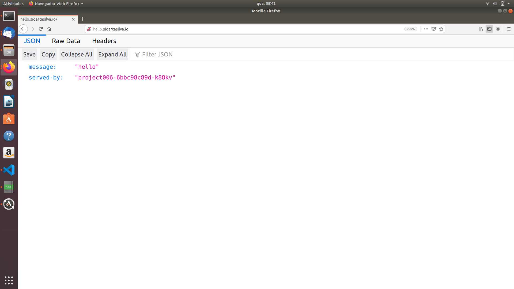
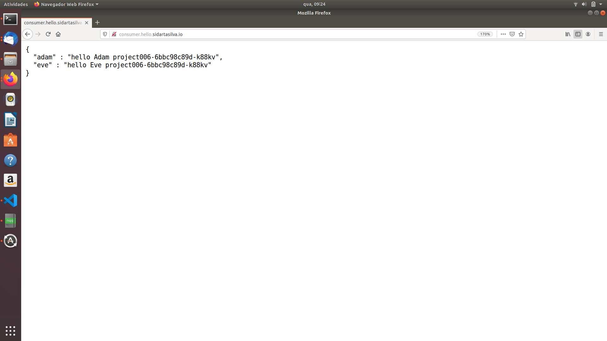
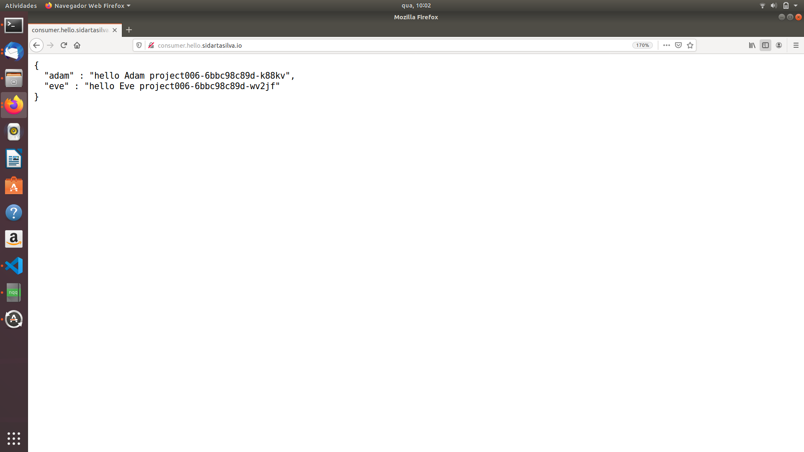

# Building Reactive Microservice Systems

This project is based mainly on the references below.

    ESCOFFIER, C. Building Reactive Microservices in Java Asynchronous and Event-Based Application Design. First Edition. California: O’Reilly Media, Inc., 2017.

    RedHat Developer, accessed 1 November 2019, <https://developers.redhat.com/promotions/building-reactive-microservices-in-java>

    Kubernetes Hands-On - Deploy Microservices to the AWS Cloud 2018, Udemy, accessed 1 November 2019, <https://www.udemy.com/course/kubernetes-microservices>

    <https://github.com/hazelcast/hazelcast-code-samples/>

    <https://vertx.io/docs/vertx-hazelcast>

## Service Discovery

When you have a set of microservices, the first question you have to answer is: how will these microservices locate each other?

In order to communicate with another peer, a microservice needs to know its address.

As we did before, we could hard-code the address (event bus address, URLs, location details, etc.) in the code or have it externalized into a configuration file. 

However, this solution does not enable mobility. 

Our application will be quite rigid and the different pieces won't be able to move, which contradicts what we try to achieve with microservices.

### Client- and Server-Side Service Discovery

Microservices need to be mobile but addressable.

A consumer needs to be able to communicate with a microservice without knowing its exact location in advance, especially since this location may change over time.

Location transparency provides elasticity and dynamism: the consumer may call different instances of the microservice using a round-robin strategy, and between two invocations the microservice may have been moved or updated.

Location transparency can be addressed by a pattern called service discovery.

Each microservice should announce how it can be invoked and its characteristics, including its location of course, but also other metadata such as security policies or versions.

These announcements are stored in the service discovery infrastructure, which is generally a service registry provided by the execution environment.

A microservice can also decide to withdraw its service from the registry.

A microservice looking for another service can also search this service registry to find matching services, select the best one (using any kind of criteria), and start using it.

Two types of patterns can be used to consume services.

When using client-side service discovery, the consumer service looks for a service based on its name and metadata in the service registry, selects a matching service, and uses it.

The reference retrieved from the service registry contains a direct link to a microservice. As microservices are dynamic entities, the service discovery infrastructure must not only allow providers to publish their services and consumers to look for services, but also provide information about the arrivals and departures of services.

When using client-side service discovery, the service registry can take various forms such as a distributed data structure, a dedicated infrastructure such as Consul, or be stored in an inventory service such as Apache Zookeeper or Redis.

Alternatively, you can have server-side service discovery and let a load balancer, a router, a proxy, or an API gateway manage the discovery for you. 

The consumer still looks for a service based on its name and metadata but retrieves a virtual address.

When the consumer invokes the service, the request is routed to the actual implementation. You would use this mechanism on Kubernetes or when using AWS Elastic Load Balancer.

### Vert.x Service Discovery

Vert.x provides an extensible service discovery mechanism.

You can use client-side or server-side service discovery using the same API.

The Vert.x service discovery can import or export services from many types of service discovery infrastructures such as Consul or Kubernetes.

It can also be used without any dedicated service discovery infrastructure. In this case, it uses a distributed data structure shared on the Vert.x cluster.

We can retrieve services by types to get a configured service client ready to be used. A service type can ge an HTTP endpoint, an event bus address, a data source, and so on. For example, if we want to retrieve the Http endpoint named hello that we implemented in the previous chapter, we would write the following code:

        // We create an instance of service discovery
        ServiceDiscovery discovery = ServiceDiscovery.create(vertx)
        // As we know we want to use an Http microservice, we can retrieve 
        // a WebClient already configured for the service 
        HttpEndpoint
            .rxGetWebClient(discovery,
                // This method is a filter to select the service
                rec -> rec.getName().endsWith("hello")
            )
            .flatMap(client ->
                // We have retrieved the WebClient, use it to call the service
                client.get("/").as(BodyCodec.string()).rxSend())
            .subscribe(response -> System.out.println(response.body));

The retrieved WebClient is configured with the service location, which means you can immediately use it to call the service.

If your environment is using client-side discovery, the configured URL targets a specific instance of the service.

If you are using server-side discovery, the client uses a virtual URL.

Depending on your runtime infrastructure, you may have to register your service.

But when using server-side discovery, you usually don't have to do this since you declare your service when it is deployed. Otherwise, you need to publish your service explicity.

To publish a service, you need to create a Record containing the service name, location, and metadata:

    // We create the service discovery object
    ServiceDiscovery discovery = ServiceDiscovery.create(vertx);
    vertx.createHttpServer()
            .requestHandler(req -> req.response().end("hello"))
            .rxListen(8083)
            .flatMap(
                Once the Http server is started we publish the service
                server -> {
                    // We create a record describing the service and its location (for Http endpoint)
                    Record record = HttpEndpoint .createRecord(
                        "hello"                 // the name of the service
                        "localhost"             // the host
                        server.actualPort(),    // the port
                        "/"                     // the root of the endpoint
                    );
                    // We publish the service
                    return discovery.rxPublish(record);
                }
            )
            .subscribe(rec -> System.out.println("Service published"));

### Deploying a Microservice in Kubernetes

The code we are going to deploy is contained in the project-006 directory of the code repository.

The verticle is very close to the hello microservice (Http) we developed earlier.

        @Override
        public void start() {
            Router router = Router.router(vertx);
            router.get("/")
                    .handler(this::hello);
            router.get("/:name")
                    .handler(this::hello);
            vertx.createHttpServer()
                    .requestHandler(router::accept)
                    .listen(8080);
        }

        private void hello(RoutingContext rc) {
            String message = "hello";
            if (rc.pathParam("name") != null) {
                message += " " + rc.pathParam("name");
            }
            JsonObject json = new JsonObject()
                    .put("message", message)
                    .put("served-by", System.getenv("HOSTNAME"));
            rc.response()
                    .putHeader(HttpHeaders.CONTENT_TYPE, "application/json")
                    .end(json.encode());

        }

### hello Microservice Yaml File

As we look into the yaml folder, we can see the ingress-public-hello.yaml file, which is in charge of creating an Ingress service to route the hello service that we named as project006.

        apiVersion: extensions/v1beta1
        kind: Ingress
        metadata:
        name: public-routing-hello
        spec:
        rules:
            - host: hello.sidartasilva.io
            http:
                paths:
                - path: /
                    backend:
                    serviceName: project006
                    servicePort: 8080

If we open the browser to http://hello.sidartasilva.io, we're able to see the following:

Where project006-6bbc98c89d-k88kv is the name of the pod serving the request.

## Service Discovery

Now that we have the hello microservice deployed, let's consume it from another microservice.

The code we are going to deploy in this section is contained in the project007 directory from the code repository.

To consume a microservice, we first have to find it. 

Service lookup can be done using environment variables, DNS, or the Vert.x service discovery, which we use here.

The project.xml is configured to import the Vert.x service discovery, the Kubernetes service importer, and a server-side service discovery.

Our consumer is going to retrieve this Kubernetes service and not the pods.

            private WebClient hello;

            @Override
            public void start() {
                Router router = Router.router(vertx);
                router.get("/")
                        .handler(this::invokeHelloMicroservice);

                // Create the service discovery instance
                ServiceDiscovery.create(vertx, discovery -> {
                    // Look up for an Http endpoint named "project006"
                    Single<WebClient> single = HttpEndpoint.rxGetWebClient(
                        discovery, rec -> rec.getName().equalsIgnoreCase("project006"),
                        new JsonObject().put("keepAlive", false)
                    );

                    single.subscribe(
                        client -> {
                            // the configured hello to call our microservice
                            this.hello = client;
                            
                            // start the Http server
                            
                            vertx.createHttpServer()
                                    .requestHandler(router::accept)
                                    .listen(8081);

                        },
                        err -> System.out.println("Oh no, no service")
                    );
                });

            }

            private void invokeHelloMicroservice(RoutingContext rc) {
                HttpRequest<JsonObject> request1 = hello.get("/Adam")
                        .as(BodyCodec.jsonObject());

                HttpRequest<JsonObject> request2 = hello.get("/Eve")
                        .as(BodyCodec.jsonObject());

                Single<HttpResponse<JsonObject>> s1 = request1.rxSend();
                Single<HttpResponse<JsonObject>> s2 = request2.rxSend();

                Single.zip(s1, s2, (adam, eve) -> {
                    return new JsonObject()
                            .put("adam", adam.body().getString("message")
                                + " " + adam.body().getString("served-by")
                            )
                            .put("eve", eve.body().getString("message")
                                + " " + eve.body().getString("served-by")
                            );
                })
                .subscribe(
                    x -> rc.response().end(x.encodePrettily()),
                    t -> rc.response().end(new JsonObject().encodePrettily())
                );
            }

In the start method, we use the service discovery to find the hello microservice.

Then, if the service is available, we start the Http server and keep a reference on the retrieved WebClient.

We also pass a configuration to the WebClient and disable the keep-alive settings.

In the invokeHelloMicroservice, we don't have to pass the port and host to the rxSend method. Indeed, the WebClient is configured to target the hello service.

### hello consumer Yaml File

As we can see into the ingress-public-consumer-hello.yaml file, the Ingress service is routing the hello-consumer service which we named as project007.

            apiVersion: extensions/v1beta1
            kind: Ingress
            metadata:
            name: public-routing-consumer-hello
            spec:
            rules:
                - host: consumer.hello.sidartasilva.io
                http:
                    paths:
                    - path: /
                        backend:
                        serviceName: project007
                        servicePort: 8081

Now, by entering http://consumer.hello.sidartasilva.io in the browser, we're able to see the output as the following.

And by looking into the logs of hello-consumer Pod, we're able to check our services being published in the Vert.x Service Registry:

        INFO: Kubernetes service published in the vert.x service registry: {"location":{"endpoint":"http://10.101.140.128:8080","host":"10.101.140.128","port":8080,"root":"","ssl":false},"metadata":{"kubernetes.namespace":"default","kubernetes.name":"project006","kubernetes.uuid":"171eb7da-3484-47be-96ca-1d2c8798d4bc"},"name":"project006","registration":"7e883462-ae21-4480-818c-4f1c64c98d1b","status":"UP","type":"http-endpoint"}

        INFO: Kubernetes service published in the vert.x service registry: {"location":{"endpoint":"http://10.102.247.110:8081","host":"10.102.247.110","port":8081,"root":"","ssl":false},"metadata":{"kubernetes.namespace":"default","kubernetes.name":"project007","kubernetes.uuid":"d12fb2ce-e0b2-4ab5-a3aa-e9c5841241ac"},"name":"project007","registration":"2600a367-c335-4285-bdb8-523aae6e1b36","status":"UP","type":"http-endpoint"}

### Scale Up and Down

If we are using a cloud platform, it's mainly for scalability reasons. 

We want to be able to increase and decrease the number of instances of our application depending on the load. 

In the Kubernetes Deployment, we can scale the number of Pods up and down, as shown below in the hello microservice Deployment.

            apiVersion: apps/v1
            kind: Deployment
            metadata:
            name: project006
            spec:
            selector:
                matchLabels:
                app: project006
            replicas: 2

            apiVersion: apps/v1
            kind: Deployment
            metadata:
            name: project006
            spec:
            selector:
                matchLabels:
                app: project006
            replicas: 1

Let's create a second instance of our hello microservice. 

        kubectl apply -f deployment-project006.yaml

Then wait until the second microservice has started correctly and go back to the hello-consumer page in a browser. We should see something like:

If we refresh several times, we'll see that the Kubernetes service balances the load between the two instances.

Now let's look into the keep-alive settings we disabled.

When the Http connection uses a keep-alive connection, Kubernetes forwards the request to the same Pod, providing connection affinity. 

We should note that in practice, keep-alive is a very desirable header as it allows reusing connections.

In the previous scenario there is a small issue. When we scale up, Kubernetes starts dispatching requests to the new Pod without checking whether the application is ready to serve these requests.

So, our consumer may call a microservice that is not ready and get a failure.

There is a couple of ways to address this:

1. Using health checks in the microservice

2. Be prepared to face the failure in the consumer code

